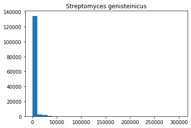

# Google Colab
### [Ссылка на ноутбук](https://colab.research.google.com/drive/1zORRcB3bqc1hI3YroYqpqKIGkLjPu5JU?usp=sharing)

Образец
---
- **Таксон:** Actinobacteria
- **Род:** Streptomyces
  
| # | Геном                       | Сборка        | Размер (Mb) | % GC |
|---|--------------------------------|-----------------|-------------|------|
| 1 | Streptomyces galilaeus ATCC 14969    | GCA_008704575.1 | 7,75619  | 71,4 |
| 2 | Streptomyces gardneri ATCC 15439    | GCA_015710995.1 | 9,0548  | 71,7 |
| 3 | Streptomyces genisteinicus CRPJ-33   | GCA_014489615.1 | 8,18835  | 73,4446 |
| 4 | Streptomyces gilvosporeus F607        | GCA_002082195.1 | 8,4823  | 71 |
| 5 | Streptomyces globosus LZH-48      | GCA_003325375.1 | 7,53575 | 73,6277 |

Аннотирование
---
| # | Геном                      | Аннотированных генов            | % Аннотированных генов |
|---|-------------------------------|---------------------------------|------------------------|
| 1 | Streptomyces galilaeus ATCC 14969   | 6834591                          | 72.89                   |
| 2 | Streptomyces gardneri ATCC 15439   | 8033281                          | 80.4                   |
| 3 | Streptomyces genisteinicus CRPJ-33  | 7066001                          | 76.99                   |
| 4 | Streptomyces gilvosporeus F607      | 7310110                          | 71.49                   |
| 5 | Streptomyces globosus LZH-48      | 6592482                          | 74.09                   |

Предсказанные Z-DNA
---
| # | Геном                    | Количество | Длина       | Средняя длина | Средний ZH-Score |
|---|-----------------------------|------------|-------------|------------------------------|-------------------------|
| 1 | Streptomyces galilaeus ATCC 14969 | 120590 | 1231300 | 10.210631063935649                      | 4005               |
| 2 | Streptomyces gardneri ATCC 15439 | 124534 | 1263950 | 10.149437101514446                      | 3046               |
| 3 | Streptomyces genisteinicus CRPJ-33 | 139829 | 1431002 | 10.233942887383876                      | 2680               |
| 4 | Streptomyces gilvosporeus F607     | 105401 | 1060748 | 10.063927287217389                      | 2241               |
| 5 | Streptomyces globosus LZH-48   | 121308 | 1246356 | 10.274310020773568                      | 2663               |

Гистограммы ZH-Score
---

Расположение предсказанных Z-DNA
---
Streptomyces galilaeus

Streptomyces gardneri

Streptomyces genisteinicus

Streptomyces gilvosporeus

Streptomyces globosus

